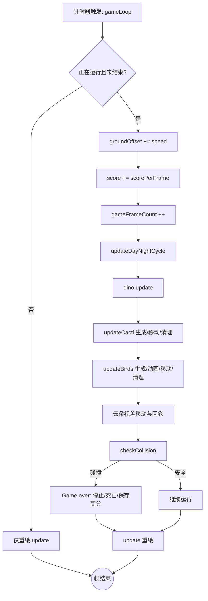

# 游戏核心逻辑概述

本文总结游戏的核心流程与关键模块，帮助理解一帧内的更新顺序以及各子系统间的关系。适用于快速上手代码或排查逻辑问题。

## 主要模块
- **输入处理**：键盘空格（开始/跳跃）、方向下键（下蹲/取消下蹲），鼠标点击重开按钮。
- **状态管理**：`isRunning`、`isGameOver`、分数、高分、帧计数、昼夜周期状态。
- **角色与障碍**：恐龙（跑、跳、蹲、死亡）、仙人掌、鸟类，均随地速向左移动。
- **世界与渲染**：地面滚动、云朵视差、昼夜背景渐变、分数显示、GameOver/重开 UI。
- **碰撞检测**：矩形粗判 + 像素级 alpha 判定（恐龙 vs 仙人掌/鸟）。
- **资源配置**：尺寸、速度、生成概率/间隔、昼夜配置由 `gameconfig.h` 驱动。

## 一帧内的完整流程（Mermaid）

## 关键更新点说明
- **地面与云朵**：地面随 `speed` 向左滚动，云朵以 `speed / cloudSpeedDivisor` 移动并循环换位。
- **障碍生成**：`updateCacti()`/`updateBirds()` 内部基于 `spawnCooldown` 与分数阈值、概率控制生成；生成时随机缩放并放置在地面基准线上（鸟使用中心距地高度）。
- **恐龙物理**：简单竖直物理：跳跃初速度 `jumpSpeed`，重力累加；落地复位速度与跳跃状态。
- **昼夜切换**：基于帧计数与 `dayNightCycleFrames` 分段插值背景色，云透明度随过渡衰减。
- **碰撞**：先粗判矩形，再对重叠区域做像素级 alpha 检测（恐龙当前帧 vs 仙人掌/鸟），任意实像素重叠即判定死亡。

## 主要文件索引
- `src/gamewindow.cpp`：主循环 `gameLoop`、生成/更新/碰撞、昼夜、渲染。
- `src/dino.cpp` / `src/dino.h`：恐龙输入、动作、物理与当前帧数据。
- `src/gameconfig.h`：全局配置（速度、尺寸、概率、昼夜参数等）。

## 调优与扩展提示
- 性能：如需优化像素级碰撞，可缓存 ARGB32 贴图或提供矩形判定开关。
- 障碍多样性：可增加更多高度/速度模式或新障碍，复用生成与碰撞管线。
- 视觉：可扩展 UI（暂停、提示）、更多背景层级，或调整云、地面速度比实现更丰富视差。
