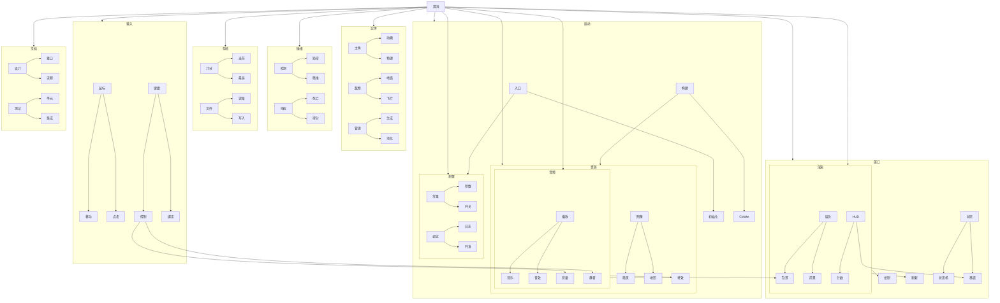

- 启动
  - 入口
    - 初始化
    - 配置
  - 构建
    - CMake
    - 资源

- 窗口
  - 渲染
    - 绘制
    - 刷新
  - 状态
    - 状态机
    - 界面

- 实体
  - 主角
    - 动画
    - 物理
  - 敌物
    - 地面
    - 飞行
  - 管理
    - 生成
    - 池化

- 输入
  - 鼠标
    - 移动
    - 点击
  - 键盘
    - 控制
    - 绑定

- 碰撞
  - 检测
    - 矩形
    - 精准
  - 响应
    - 死亡
    - 得分

- 渲染
  - 层次
    - 背景
    - 前景
  - HUD
    - 分数
    - 界面

- 资源
  - 图像
    - 精灵
    - 地形
  - 音频
    - 背景
    - 特效

- 音频
  - 播放
    - 音乐
    - 音效
  - 控制
    - 音量
    - 静音

- 存档
  - 计分
    - 当前
    - 最高
  - 文件
    - 读取
    - 写入

- 配置
  - 常量
    - 参数
    - 开关
  - 调试
    - 日志
    - 开发

- 文档
  - 设计
    - 接口
    - 流程
  - 测试
    - 单元
    - 集成

