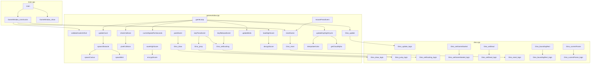

```mermaid
graph TD
    subgraph main.cpp
        main --> GameWindow_constructor
        main --> GameWindow_show
    end

    subgraph gamewindow.cpp
        GameWindow_constructor --> validateAssetsOrExit
        GameWindow_constructor --> loadHighScore
        GameWindow_constructor --> resetGame
        resetGame --> Dino_reset
        gameLoop --> currentSpeedForSeconds
        gameLoop --> updateDayNightCycle
        gameLoop --> Dino_update
        gameLoop --> updateCacti
        gameLoop --> updateBirds
        gameLoop --> checkCollision
        checkCollision --> pixelCollision
        updateCacti --> spawnObstacle
        spawnObstacle --> spawnCactus
        spawnObstacle --> spawnBird
        paintEvent --> Dino_draw
        keyPressEvent --> Dino_jump
        keyPressEvent --> Dino_setDucking
        keyReleaseEvent --> Dino_setDucking
        mousePressEvent --> resetGame
        loadHighScore --> decryptScore
        saveHighScore --> encryptScore
        updateDayNightCycle --> interpolateColor
        updateDayNightCycle --> getCloudAlpha
    end

    subgraph dino.cpp
        Dino_update --> Dino_update_logic
        Dino_draw --> Dino_draw_logic
        Dino_jump --> Dino_jump_logic
        Dino_setDucking --> Dino_setDucking_logic
        Dino_setGameStarted --> Dino_setGameStarted_logic
        Dino_setDead --> Dino_setDead_logic
        Dino_reset --> Dino_reset_logic
        Dino_boundingRect --> Dino_boundingRect_logic
        Dino_currentFrame --> Dino_currentFrame_logic
    end
```
